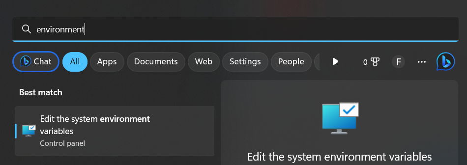
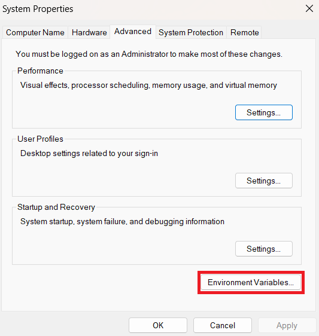
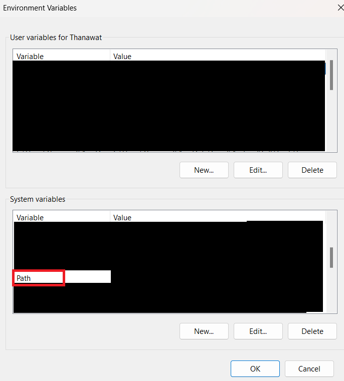
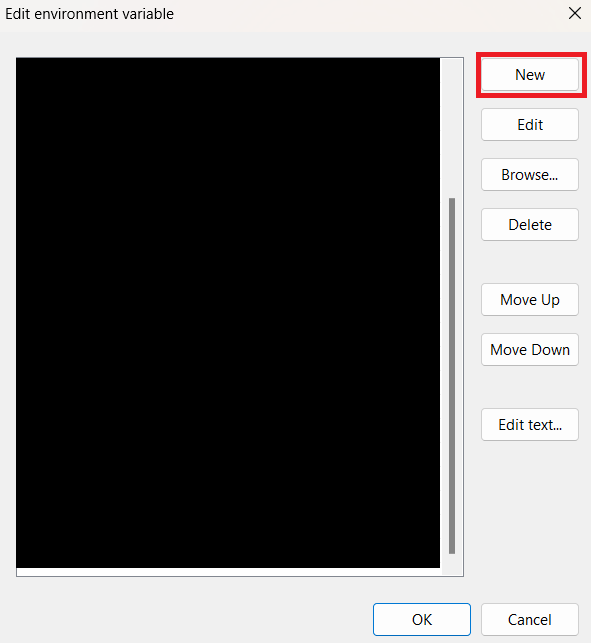

# Kubernetes
### Step on Work
1. Install tools Kubernetes

    <details>
    <summary>kubectl</summary>

    - Ref
      - https://kubernetes.io/docs/tasks/tools/install-kubectl-windows/

    - download Kubectl.exe to path want

      ```
      curl.exe -LO "https://dl.k8s.io/release/v1.26.0/bin/windows/amd64/kubectl.exe"
      ```
      
    - Add Path to environment variable

      - Search environment
  
        

      - Click Environment Variables...

        

      - Select Path Click Edit

        

      - Click New
        
        

      - Add Path that have kubectl.exe
      - Click OK
  
    - Test Kubectl enable 
      ```
      kubectl version --client
      ```

    </details>
    
    <details>
    <summary>minikube</summary>

    - Ref
      - https://minikube.sigs.k8s.io/docs/start/

    - download minikube.exe
      ```ruby
      New-Item -Path 'c:<path want to install>' -Name 'minikube' -ItemType Directory -Force #create folder minikube
      Invoke-WebRequest -OutFile 'c:<path want to install>\minikube\minikube.exe' -Uri 'https://github.com/kubernetes/minikube/releases/latest/download/minikube-windows-amd64.exe' -UseBasicParsing #download install to path
      ```

    - Add Path to environment variable run Admin
      ```ruby
      $oldPath = [Environment]::GetEnvironmentVariable('Path', [EnvironmentVariableTarget]::Machine)
      if ($oldPath.Split(';') -inotcontains 'C:<path folder minikube.exe>'){ `
      [Environment]::SetEnvironmentVariable('Path', $('{0};C:<path folder minikube.exe>' -f $oldPath), [EnvironmentVariableTarget]::Machine) `
      }
      ```
    - Restart Terminal

    </details>

    <details>
    <summary>Docker engine</summary>

    - Install Linux Ubuntu on windown
    - Install Docker Desktop
      - https://www.docker.com/products/docker-desktop/

    </details>

2. Config cluster Kubernetes
   - Ref 
     - https://minikube.sigs.k8s.io/docs/drivers/docker/

   - Create/Start Cluster minikube in docker on Command Prompt
     ```
     minikube start --driver=docker
     ```

   - Check pods cluster
     ```
     kubectl get pods -A
     ```
  
   - Check nodes 
     ```
     kubectl get nodes
     ```
   
   - Open Dashboard minikube
     ```
     minikube dashboard #open addon
     ```

   - Set Loadbalance
     ```
     minikube tunnel
     ```

3. Install Traefik
   - Ref
     - 
     - https://github.com/iamapinan/kubeplay-traefik

   - Create traefik-setup.ps1
     <details>
     <summary>Show code</summary>

     ```ps1
     #powershell

     $KUBE_NAMESPACE = Read-Host -Prompt "Please enter you namespace " #Enter name space
     Write-Output "Traefik will install to $KUBE_NAMESPACE" 

     kubectl create namespace $KUBE_NAMESPACE #create namespace on cluster
     kubectl config set-context --current --namespace=$KUBE_NAMESPACE #set config on kube defalt namespace
     kubectl apply -f https://raw.githubusercontent.com/traefik/traefik/v2.9/docs/content/reference/dynamic-configuration/kubernetes-crd-definition-v1.yml #apply CRD define resource
     kubectl apply -f https://raw.githubusercontent.com/traefik/traefik/v2.9/docs/content/reference/dynamic-configuration/kubernetes-crd-rbac.yml #apply RBAC kubernetes define role for CRD

     if ( -Not (Get-Command scoop -ErrorAction Ignore)) { #check scoop already
        #install scoop
        $username = Read-Host -Prompt "Username " #Read Username computer
        irm get.scoop.sh | iex #install scoop
        $env:Path -split ';' #define environment
        $env:Path += ";C:\Users\$username\scoop\shims" #define environment
     }

     if ( -Not (Get-Command helm -ErrorAction Ignore)) { #check helm already
        #install helm
        scoop install helm
     }

     helm repo add traefik https://traefik.github.io/charts # add repo traefik charts is traefik in helm
     helm repo update # update repo to make prepare install traefik charts
     helm install traefik traefik/traefik # Install traefik chart to make loadbalance and reverse Proxy 

     kubectl get svc -l app.kubernetes.io/name=traefik #Get service label name app.kubernetes.io/ name = traefik
     kubectl get po -l app.kubernetes.io/name=traefik #Get pod label name app.kubernetes.io/ name = traefik

     $UserTraefik = Read-Host -Prompt "Username Traefik " #Enter Username Login Traefik

     if ( -Not ("$UserTraefik" -eq " ")) { #Check emply value
        bash -c "htpasswd -nB $UserTraefik | tee auth-secret" #Create password to hash
        bash -c "kubectl create secret generic -n traefik dashboard-auth-secret --from-file=users=auth-secret -o yaml --dry-run=client | tee dashboard-secret.yaml" #Genarate secure password to users and create file dashboard-secret.yaml
     }
     ```

     </details>

   - Create file traefik-dashboard.yaml
     <details>
     <summary>Show code</summary>

    ```yaml
    apiVersion: traefik.containo.us/v1alpha1
    kind: Middleware
    metadata:
      name: traefik-basic-authen
      namespace: spcn19
    spec:
      basicAuth:
        secret: dashboard-auth-secret
        removeHeader: true
    ---
    apiVersion: v1
    data:
      users: c3BjbjE5OiQyeSQwNSQ5UHFNL3dQMGxXNC9iMTRSaEMxc3llMUJxME5VUjY2VnIxT29XZk5HVVFELzRxc09aVHNSMgoK
    kind: Secret
    metadata:
      name: dashboard-auth-secret
      namespace: spcn19
    ---
    apiVersion: traefik.containo.us/v1alpha1
    kind: IngressRoute
    metadata:
      name: traefik-dashboard
      namespace: spcn19
      annotations:
        kubernetes.io/ingress.class: traefik
        traefik.ingress.kubernetes.io/router.middlewares: traefik-basic-authen
    spec:
      entryPoints:
        - websecure
      routes:
        - match: Host(`traefik.spcn19.local`) && (PathPrefix(`/dashboard`) || PathPrefix(`/api`))
          kind: Rule
          middlewares:
            - name: traefik-basic-authen
              namespace: spcn19
          services:
            - name: api@internal
              kind: TraefikService
    ```

     </details>

   - run file traefik-setup.ps1
     ```
     ./traefik-setup.ps1
     ```
   
   - Get users to dashboard

   - Apply traefik-dashboard.yaml
     ```
     kubectl apply -f traefik-dashboard.yaml
     ```
     
   - Get detail traefik show ip
     ```
     kubectl get svc #look at EXTERNAL-IP
     ```

   - Set Domain in file host in path windows
     ```ruby
     C:\Windows\System32\drivers\etc\hosts # ex. EXTERNAL-IP traefik.spcn19.local
     ```

   - Test Open Traefik dashboard
     ```
     traefik.spcn19.local/dashboard/
     ```
4. Install Service
   - Create rancher-deployment.yaml
     <details>
     <summary>Show code</summary>
     </details>

### Command 
 - Ref 
   - https://minikube.sigs.k8s.io/docs/start/

### LINK on Local
 - traefik.spcn19.local
 - web.spcn19.local 

