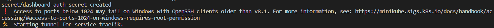
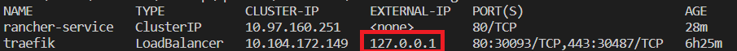
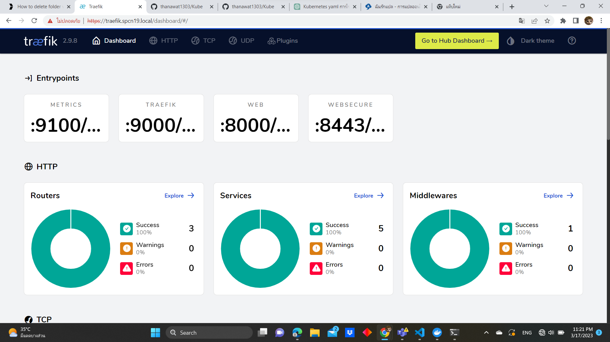
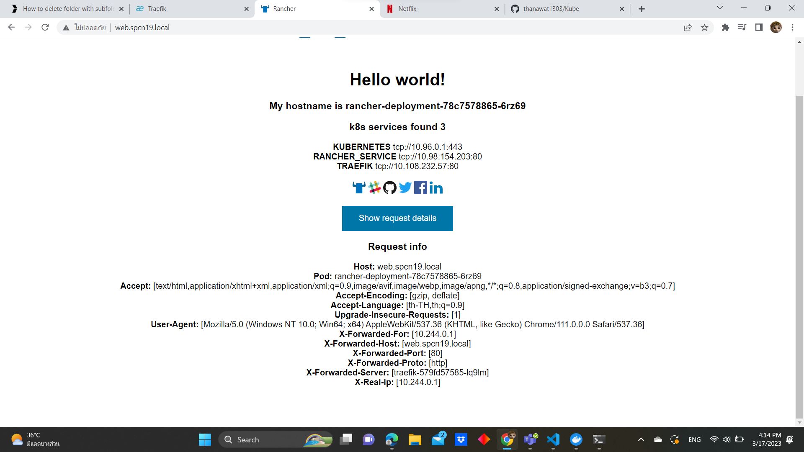

# Kubernetes windows
### Wakatime Url
  - https://wakatime.com/@spcn19/projects/gjjbzeqbft

---

### Step on Work
<div> 

:baby_bottle: [Install tools kubernetes](#install-tools)
</div>
<div>

:earth_asia: [Config cluster kubernetes](#Config-cluster)
</div>
<div>

:globe_with_meridians: [Deploy traefik](#deploy-traefik)
</div>
<div> 

:snowman: [Deploy service](#deploy-service)
</div>

---

1. Install tools kubernetes <a id="install-tools"></a>
    <details>
    <summary>Ref</summary>

    - https://youtu.be/g-9H2urCSVY

    </details>

    <details>
    <summary>kubectl</summary>

    - Ref
      - https://kubernetes.io/docs/tasks/tools/install-kubectl-windows/

    - download Kubectl.exe to path want

      ```
      curl.exe -LO "https://dl.k8s.io/release/v1.26.0/bin/windows/amd64/kubectl.exe"
      ```
      
    - Add Path to environment variable

      - Search environment
  
        

      - Click Environment Variables...

        

      - Select Path Click Edit

        

      - Click New
        
        

      - Add Path that have kubectl.exe
      - Click OK
  
    - Test Kubectl enable 
      ```
      kubectl version --client
      ```

    </details>
    
    <details>
    <summary>minikube</summary>

    - Ref
      - https://minikube.sigs.k8s.io/docs/start/

    - download minikube.exe
      ```ruby
      New-Item -Path 'c:<path want to install>' -Name 'minikube' -ItemType Directory -Force #create folder minikube
      Invoke-WebRequest -OutFile 'c:<path want to install>\minikube\minikube.exe' -Uri 'https://github.com/kubernetes/minikube/releases/latest/download/minikube-windows-amd64.exe' -UseBasicParsing #download install to path
      ```

    - Add Path to environment variable run Admin
      ```ruby
      $oldPath = [Environment]::GetEnvironmentVariable('Path', [EnvironmentVariableTarget]::Machine)
      if ($oldPath.Split(';') -inotcontains 'C:<path folder minikube.exe>'){ `
      [Environment]::SetEnvironmentVariable('Path', $('{0};C:<path folder minikube.exe>' -f $oldPath), [EnvironmentVariableTarget]::Machine) `
      }
      ```
    - Restart Terminal

    </details>

    <details>
    <summary>Docker engine</summary>

    - Install linux ubuntu on windows
    - Install docker desktop
      - https://www.docker.com/products/docker-desktop/

    - Open docker desktop

    </details>

2. Config cluster kubernetes <a id="Config-cluster"></a>
   - Ref 
     - https://youtu.be/g-9H2urCSVY
     - https://minikube.sigs.k8s.io/docs/drivers/docker/

   - Create/Start Cluster minikube in docker on Command Prompt
     ```
     minikube start --driver=docker
     ```

   - Check pods cluster
     ```
     kubectl get pods -A
     ```
  
   - Check nodes 
     ```
     kubectl get nodes
     ```
   
   - Open Dashboard minikube
     ```
     minikube dashboard #open addon
     ```
     <details>
     <summary>Show dashboard</summary>

     

     </details>

   - Start Loadbalance minikube
     ```
     minikube tunnel
     ```
     <details>
     <summary>Show tunnel start</summary>

     

     </details>

3. Deploy traefik <a id="deploy-traefik"></a>
   - Ref
     - https://youtu.be/NpKkD6t278M
     - https://github.com/iamapinan/kubeplay-traefik

   - <details>
     <summary>Create file traefik-dashboard.yaml</summary>

      ```yaml
      apiVersion: traefik.containo.us/v1alpha1 #define api version is traefik.containo.us/v1alpha1 for revert proxy , load balance and auto set SSL/TLS option traefik
      kind: Middleware #define type object is Middleware for connect service
      metadata:
        name: traefik-basic-authen #define name object traefik-basic-authen
        namespace: spcn19 #define namespace want install traefik-basic-authen
      spec: #define spec in traefik-basic-authen
        basicAuth: #define secure for access to traefik
          secret: dashboard-auth-secret #define pod secure this is name dashboard-auth-secret
          removeHeader: true #set remove header for upspeed and up efficiency
      ---
      apiVersion: traefik.containo.us/v1alpha1
      kind: IngressRoute #define type object ingressRount for setup route
      metadata:
        name: traefik-dashboard
        namespace: spcn19 #define namespace want install traefik-dashboard
        annotations:
          kubernetes.io/ingress.class: traefik #define connect ingress this is traefik for set ingress
          traefik.ingress.kubernetes.io/router.middlewares: traefik-basic-authen #define middleware use in ingress by start from ingress.class
      spec: #define spec in traefik-dashboard
        entryPoints:
          - websecure #define entrypoints is websecure
        routes: #define route
          - match: Host(`traefik.spcn19.local`) && (PathPrefix(`/dashboard`) || PathPrefix(`/api`)) #define condition access traefik-dashboard
            kind: Rule #define type object is Rule for access
            middlewares: #define middleware before access service api@internal
              - name: traefik-basic-authen #use middleware name traefik-basic-authen authentication
                namespace: spcn19 #this run on space spcn19
            services: #services on Traefik
              - name: api@internal #name service
                kind: TraefikService #define type object is TraefikService for service api@internal
      ```

     </details>

   - <details>
     <summary>Step by Step</summary>
      
      - Create namespace
        ```ps1
        kubectl create namespace <namespace>
        kubectl config set-context --current --namespace=<namespace>
        ```

      - Deploy CRD and RBAC of kubernetes
        ```ps1
        kubectl apply -f https://raw.githubusercontent.com/traefik/traefik/v2.9/docs/content/reference/dynamic-configuration/kubernetes-crd-definition-v1.yml
        kubectl apply -f https://raw.githubusercontent.com/traefik/traefik/v2.9/docs/content/reference/dynamic-configuration/kubernetes-crd-rbac.yml
        ```

      - Install helm
        ```ps1
        Set-ExecutionPolicy RemoteSigned -Scope CurrentUser
        irm get.scoop.sh | iex
        scoop install helm
        ```

      - Install traefik chart
        ```
        helm repo add traefik https://traefik.github.io/charts
        helm repo update 
        helm install traefik traefik/traefik
        ```

      - Check service and pod traefik
        ```ps1
        kubectl get svc -l app.kubernetes.io/name=traefik
        kubectl get po -l app.kubernetes.io/name=traefik
        ```

      - Define authenticat password traefik
        ```ps1
        bash -c "htpasswd -nB user | tee auth-secret"
        kubectl create secret generic -n <namespace> dashboard-auth-secret --from-file=users=auth-secret -o yaml --dry-run=client | tee dashboard-secret.yaml
        ```

      - Deploy traefik and dashboard
        ```ps1
        kubectl apply -f traefik-dashboard.yaml
        ```

      - Deploy secure authentication traefik
        ```ps1
        kubectl apply -f dashboard-secret.yaml
        ```
    
     </details>

   - <details>
     <summary>Easy step</summary>
      
      - <details>
        <summary>Create file traefik-setup.ps1</summary>

        ```ps1
        #powershell

        $KUBE_NAMESPACE = Read-Host -Prompt "Please enter namespace in file traefik-dashboard.yaml " #Enter name space same namespace in traefik-dashboard.yaml
        Write-Output "Traefik will install to $KUBE_NAMESPACE" 

        kubectl create namespace $KUBE_NAMESPACE #create namespace on cluster
        kubectl config set-context --current --namespace=$KUBE_NAMESPACE #set config on kube defalt namespace
        kubectl apply -f https://raw.githubusercontent.com/traefik/traefik/v2.9/docs/content/reference/dynamic-configuration/kubernetes-crd-definition-v1.yml #deploy CRD define resource ingress middleware tls
        kubectl apply -f https://raw.githubusercontent.com/traefik/traefik/v2.9/docs/content/reference/dynamic-configuration/kubernetes-crd-rbac.yml #apply RBAC kubernetes define role for CRD

        if ( -Not (Get-Command scoop -ErrorAction Ignore)) { #check scoop already
          #install scoop
          $username = Read-Host -Prompt "Username " #Read Username computer
          irm get.scoop.sh | iex #install scoop
          $env:Path -split ';' > $null #define environment
          $env:Path += ";C:\Users\$username\scoop\shims" > $null #define environment
        }

        if ( -Not (Get-Command helm -ErrorAction Ignore)) { #check helm already
          #install helm
          scoop install helm
        }

        helm repo add traefik https://traefik.github.io/charts # add repo traefik charts is traefik in helm
        helm repo update # update repo to make prepare install traefik charts
        helm install traefik traefik/traefik # Install traefik chart to make loadbalance and reverse Proxy 

        kubectl get svc -l app.kubernetes.io/name=traefik #Get service label name app.kubernetes.io/ name = traefik
        kubectl get po -l app.kubernetes.io/name=traefik #Get pod label name app.kubernetes.io/ name = traefik

        $UserTraefik = Read-Host -Prompt "Username Traefik " #Enter Username Login Traefik

        if ( -Not ("$UserTraefik" -eq " ")) { #Check emply value
          bash -c "htpasswd -nB $UserTraefik | tee auth-secret" #Create password to hash and secret of authenticat traefik
          kubectl create secret generic -n $KUBE_NAMESPACE dashboard-auth-secret --from-file=users=auth-secret -o yaml --dry-run=client | tee dashboard-secret.yaml
            #create kubernetes secure and create dashboard-secret.yaml
            # -n => namespace
            # --from-file=users=auth-secret => set secure from file auth-secret and use is key users
            # -o yaml => output file .yaml
            # --dry-run=client => create secure object not sent to kube API server but will check syntax and validation
          kubectl apply -f traefik-dashboard.yaml #Deploy traefik-dashboard.yaml for start traefik and dashboard
          kubectl apply -f dashboard-secret.yaml #Deploy dashboard-secret.yaml for start secure authentication traefik
          rm auth-secret #remove file auth-secret 
          rm dashboard-secret.yaml #remove file dashboard-secret.yaml
        }
        ```

        </details>

      - Run file traefik-setup.ps1
      ```
      ./traefik-setup.ps1
      ```

     </details>
    
   - Example dashboard-secret.yaml 
     <details>
     <summary>Show code</summary>

      ```yaml
      apiVersion: v1
      data:
        users: "" #genarate hash by kubectl create secret generic
      kind: Secret #define type object is Secret for authentication
      metadata:
        creationTimestamp: null
        name: dashboard-auth-secret
        namespace: "" #match Traefik in here genarate by powershell user enter namespace
      ```

     </details>

   - Get detail traefik show ip
     ```
     kubectl get svc #look at EXTERNAL-IP
     ```
     

   - Set Domain in file host in path windows
     ```ruby
     C:\Windows\System32\drivers\etc\hosts # ex. EXTERNAL-IP traefik.spcn19.local
     ```

   - Test Open Traefik dashboard
     ```
     https://traefik.spcn19.local/dashboard/
     ```
     <details>
     <summary>Show dashboard</summary>

     

   </details>

4. Deploy service <a id="deploy-service"></a>
   - Create rancher-deployment.yaml
     <details>
     <summary>Show code</summary>
     
     ```yaml
      apiVersion: apps/v1 #define apiVersion is apps/v1
      kind: Deployment #define type object is deployment for create pod replicas and rolling update
      metadata: #define metadata for deployment
        name: rancher-deployment #define name object is rancher-deployment
        namespace: spcn19 #define namespace want install rancher-deployment
      spec:
        replicas: 1 #define node cluster want create pod
        selector: #define selector pod
          matchLabels: #define match label pod to deployment
            app: rancher #define label pod want create on deployment
        template: #define template create container
          metadata:
            labels:
              app: rancher #create on deployment matchLabels is app: rancher
          spec: #spec on pod
            containers: #create container
            - name: rancher #name container
              image: rancher/hello-world #image container
              ports: #define port need for container
              - containerPort: 80 #port 80
      ---
      apiVersion: v1
      kind: Service #define type object is Service for loadbalance
      metadata: 
        name: rancher-service
        labels:
          name: rancher-service
        namespace: spcn19 #run on namespace spcn19
      spec: #define service for access pod
        selector: #define selector pod match service will loadbalance
          app: rancher #label match pod label app: rancher => rancher-deployment
        ports:
        - name: http #name port
          port: 80 #port service running on host
          protocol: TCP #protocal that the service use
          targetPort: 80 #port that container use
      ---
      apiVersion: traefik.containo.us/v1alpha1 #define api version is traefik.containo.us/v1alpha1 for revert proxy , load balance and auto set SSL/TLS option traefik
      kind: IngressRoute #define type object ingressRount for setup route
      metadata:
        name: service-ingress
        namespace: spcn19
      spec:
        entryPoints:
          - web #http
          - websecure #https
        routes:
        - match: Host(`web.spcn19.local`) #access on url
          kind: Rule #define type object is Rule for access
          services: #define service want access
          - name: rancher-service #define service want access name rancher-service
            port: 80 #define port accesss on port 80
     ```

     </details>
   - Deploy service web rancher
     ```
     kubectl apply -f rancher-deployment.yaml
     ```
   
   - Set Domain in file host in path windows match traefik
     ```ruby
     C:\Windows\System32\drivers\etc\hosts # ex. EXTERNAL-IP web.spcn19.local 
     ```

   - Test Open rancher-service
     ```
     web.spcn19.local 
     ```
     <details>
     <summary>Show service</summary>

      

     </details>

---

### Command 
 - Ref 
   - https://minikube.sigs.k8s.io/docs/start/

---

### Link on local
 - traefik.spcn19.local
 - web.spcn19.local 

